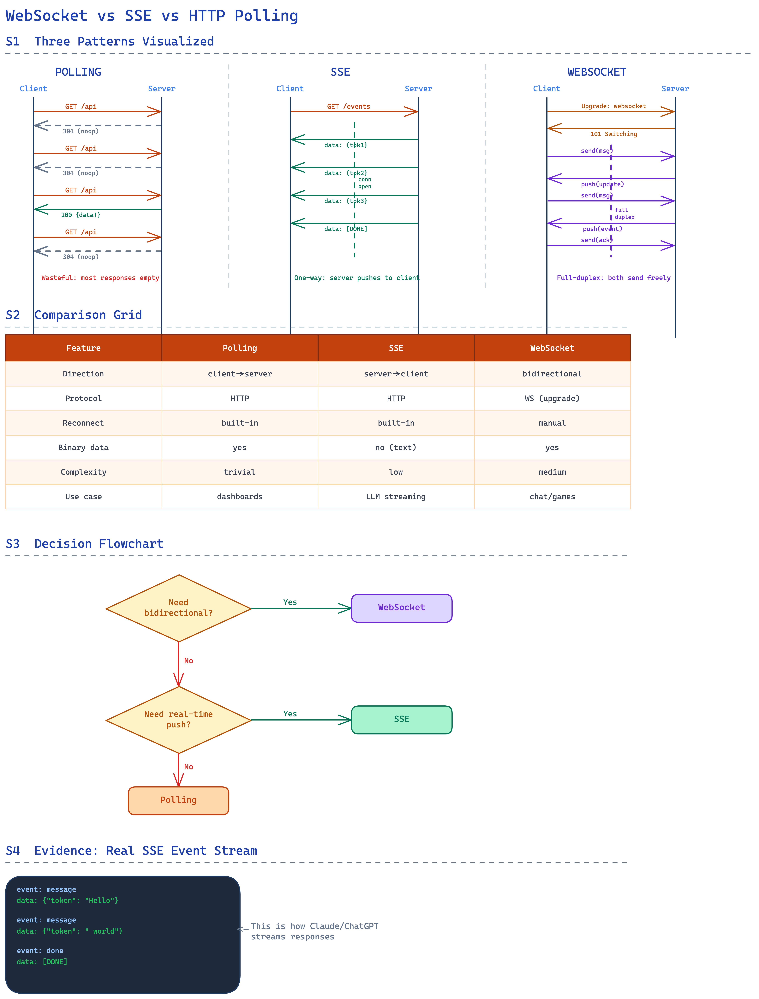
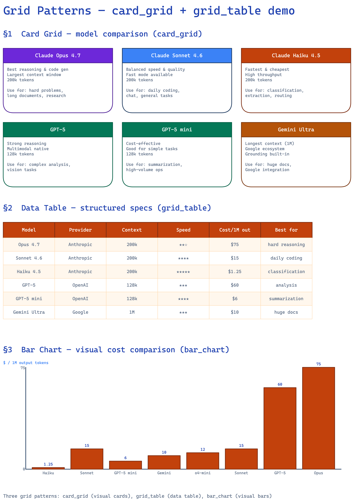
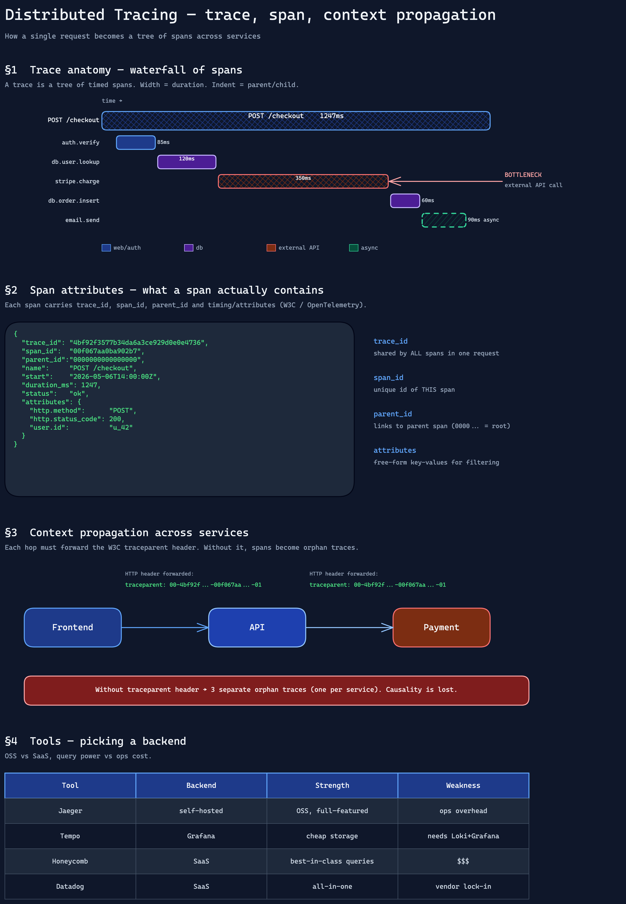
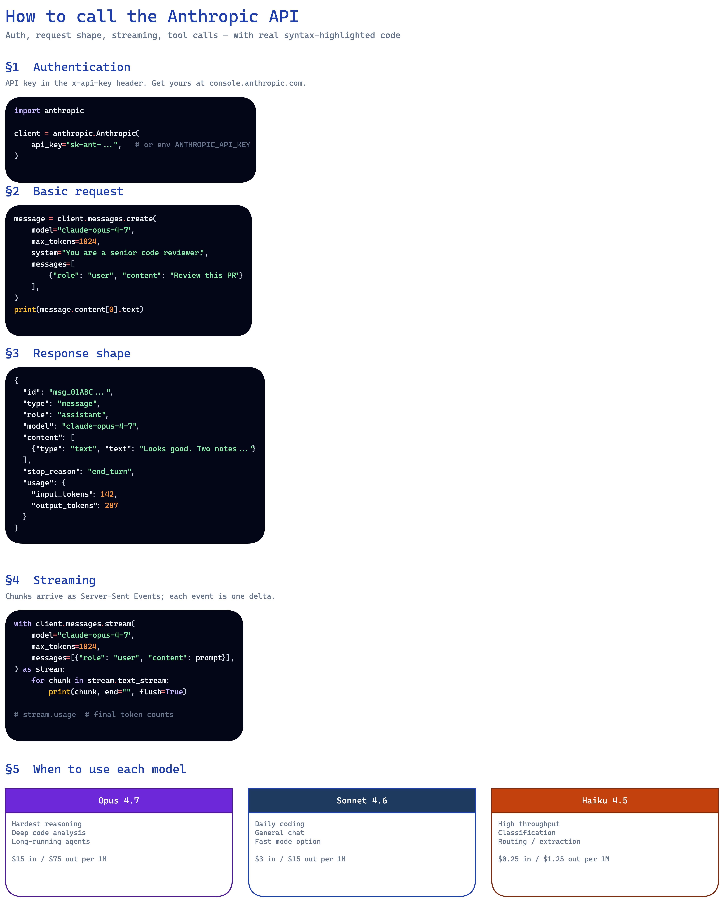
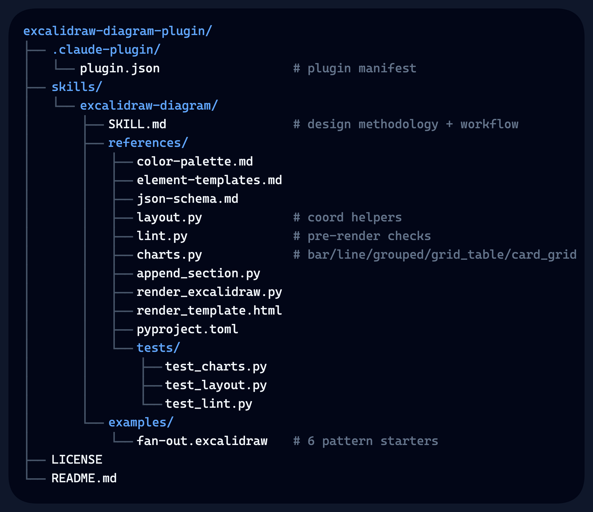
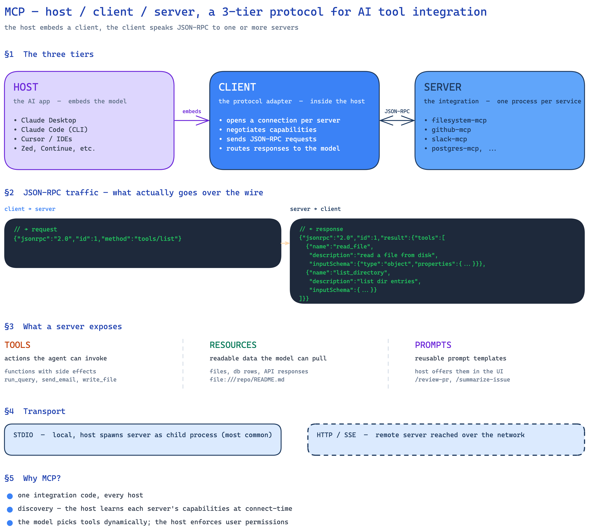
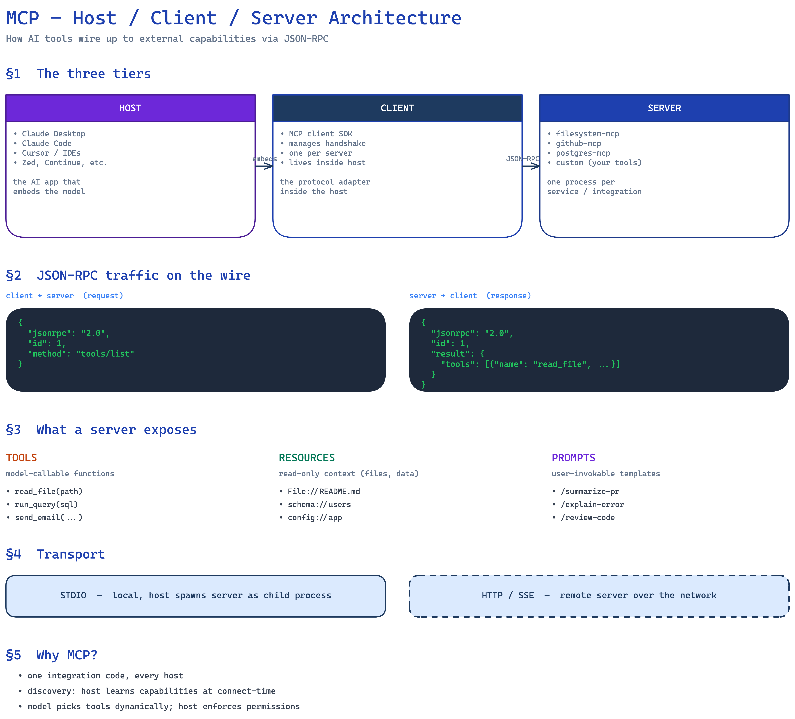

# Excalidraw Diagram Plugin

Generate `.excalidraw` JSON diagrams that **argue visually** — fan-outs, timelines, trees, grids, evidence artifacts, charts, light + dark mode. Built for Claude Code as a skill, distributed as a plugin.

## Examples

| Light mode (varied patterns) | Grid layouts | Dark mode |
|------------------------------|--------------|-----------|
|  |  |  |

### Syntax-highlighted code blocks (v1.2.0+)

Code samples are tokenized by [Pygments](https://pygments.org) and rendered as native Excalidraw text elements — one per token, each with its own color. Supports 500+ languages, light + dark themes.



```python
from charts import code_block
elements.extend(code_block(
    x=80, y=200,
    code='def hello():\n    print("hi")\n',
    language="python",       # 500+ Pygments lexers
    font_size=14,
    theme_name="dark",       # or "light"
))
```

### File-tree diagrams (v1.3.0+)

`charts.file_tree()` renders a nested directory structure with proper box-drawing connectors. Folders, files, branches and inline comments are each their own colored span — no images, no SVG, just native Excalidraw text elements.



```python
from charts import file_tree
elements.extend(file_tree(
    x=80, y=80,
    tree=[
        ("project/", [
            ("src/", [
                ("main.py", "# entry point"),
                ("util.py", None),
            ]),
            ("README.md", "# docs"),
        ]),
    ],
    font_size=14,
    theme_name="dark",
))
```

Convention: trailing `/` ⇒ folder (payload is list of children); no slash ⇒ file (payload is comment string or `None`).

## Before / after — what the tooling fixes

Same prompt ("MCP host/client/server architecture"), same agent, same model. Left: skill methodology only. Right: methodology + Python tooling (`layout`, `lint`, `charts`, evidence-artifact exception).

| Before — 8 lint issues | After — 0 lint issues |
|------------------------|------------------------|
|  |  |
| Tier rectangles overlap their inner text · 6 overlap warnings · text positioned over fills without `containerId` binding · arrows partially dangling | Tier rectangles compact (label only) · all sub-text free-floating outside · 0 overlaps · all arrows bound · container ratio 14% (well under 30% threshold) |

Across an entire 10-diagram run, total lint issues dropped **15 → 0** (-100%) while average elements per diagram increased **62 → 83** (+34% more content). Investing in tooling pays.

## What this plugin gives you

- **Design methodology** (`SKILL.md`) — visual argument patterns, evidence artifacts, fill/stroke styles, multi-zoom architecture, dark mode
- **Layout helpers** (`references/layout.py`) — `fan_out`, `timeline`, `tree`, `side_by_side`, `section`, `stack`, `grid`, `estimate_text_size`
- **Charts** (`references/charts.py`) — `bar_chart`, `line_chart`, `grouped_bar_chart`, `pie_slice_approximation`, `card_grid`, `grid_table`, `code_block`, `file_tree`
- **Pre-render lint** (`references/lint.py`) — overlap, dangling arrows, text overflow, container ratio (with evidence-artifact exception)
- **Section append CLI** (`references/append_section.py`) — merge sections with auto seed-namespacing
- **Pattern gallery** (`examples/`) — 6 starter `.excalidraw` files (fan-out, timeline, tree, side-by-side, assembly-line, convergence)
- **Render pipeline** (`references/render_excalidraw.py`) — Playwright-based PNG generation
- **Regression tests** (`references/tests/`) — pytest suite, 20 tests

## Install

### Via Claude Code plugin (recommended) — two steps

```
/plugin marketplace add gilbertsahumada/excalidraw-diagram-plugin
/plugin install excalidraw-diagram@excalidraw-diagram-plugin
```

After install, the skill is namespaced as `excalidraw-diagram:excalidraw-diagram`.

To list / update / remove:

```
/plugin list
/plugin update excalidraw-diagram
/plugin remove excalidraw-diagram
```

### Manual (skill-only, no plugin system)

```bash
git clone https://github.com/gilbertsahumada/excalidraw-diagram-plugin.git
cp -r excalidraw-diagram-plugin/skills/excalidraw-diagram .claude/skills/
```

### Local plugin testing (before pushing changes)

```bash
# Add your local clone as a marketplace
/plugin marketplace add /path/to/excalidraw-diagram-plugin
/plugin install excalidraw-diagram@excalidraw-diagram-plugin
```

## One-time setup (renderer)

The Python tooling needs Playwright + Chromium to render `.excalidraw` → PNG. Run once after install:

```bash
cd .claude/skills/excalidraw-diagram/references
uv sync
uv run playwright install chromium
```

Requires [`uv`](https://github.com/astral-sh/uv) (Python package manager). Install with `curl -LsSf https://astral.sh/uv/install.sh | sh`.

## Usage

In Claude Code:

```
/excalidraw-diagram:excalidraw-diagram
```

Or just ask naturally:

> Create a diagram explaining the OAuth 2.0 authorization code flow

The skill auto-detects intent, selects appropriate visual patterns, and produces a `.excalidraw` JSON file. Run the render script to generate a PNG.

## Manual render

```bash
cd .claude/skills/excalidraw-diagram/references
uv run python render_excalidraw.py /path/to/diagram.excalidraw
# → PNG written next to the .excalidraw file
```

## Lint before render

```bash
uv run python lint.py /path/to/diagram.excalidraw
# Optional: relax container ratio for table-heavy diagrams
uv run python lint.py /path/to/diagram.excalidraw --container-ratio-max 0.6
```

## Customize colors

Edit `references/color-palette.md` — single source of truth for shape colors, text hierarchy, evidence artifacts, and dark mode. Everything else is universal design methodology.

## Dark mode

Set `appState.viewBackgroundColor: "#0f172a"` and use the dark palette section in `color-palette.md`. The `theme()` helper in `charts.py` returns the right colors:

```python
from charts import theme
t = theme('dark')
appState = {'viewBackgroundColor': t['bg']}
title_color = t['title']
primary_fill = t['primary_fill']
```

## File structure

```
excalidraw-diagram-plugin/
├── .claude-plugin/
│   └── plugin.json              # plugin manifest
├── skills/
│   └── excalidraw-diagram/
│       ├── SKILL.md             # design methodology + workflow
│       ├── references/
│       │   ├── color-palette.md
│       │   ├── element-templates.md
│       │   ├── json-schema.md
│       │   ├── layout.py        # coord helpers
│       │   ├── lint.py          # pre-render checks
│       │   ├── charts.py        # bar/line/grouped/grid_table/card_grid
│       │   ├── append_section.py
│       │   ├── render_excalidraw.py
│       │   ├── render_template.html
│       │   ├── pyproject.toml
│       │   └── tests/           # pytest suite
│       └── examples/            # 6 pattern starters
├── LICENSE
└── README.md
```

## Credits

Forked from and inspired by [coleam00/excalidraw-diagram-skill](https://github.com/coleam00/excalidraw-diagram-skill). The original work established the design methodology (visual argument, evidence artifacts, multi-zoom architecture, render-validate loop). This plugin extends with Python tooling, charts module, regression tests, dark mode, and pattern gallery.

## License

MIT — see [LICENSE](./LICENSE).

## Contributing

Issues and PRs welcome at https://github.com/gilbertsahumada/excalidraw-diagram-plugin.
